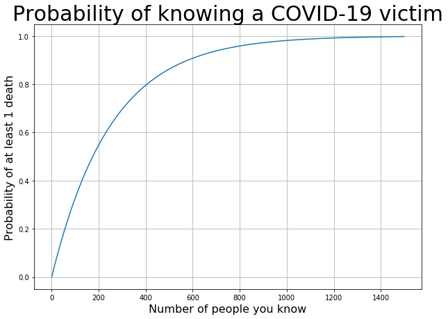
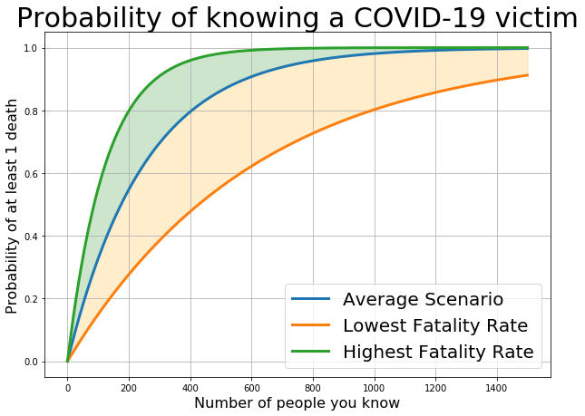
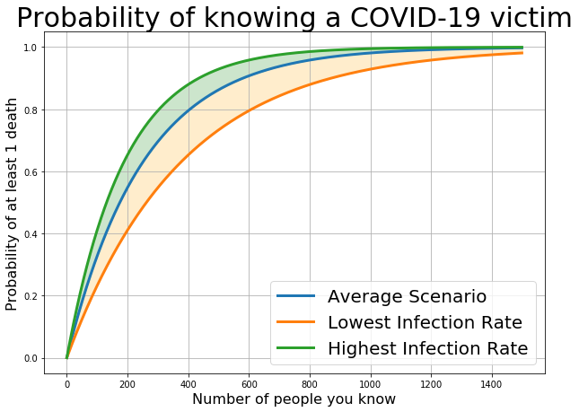

### Using the binomial distribution for a simple prediction.

*This is in no way meant to minimize or make light of the horrible situation worldwide being caused by the virus or the myriad ways in which people's health and livelihoods are affected. This is only meant to be a practical exercise and a means by which to apply some of the probability concepts which I've been reviewing.*

While playing a game of pandemic the other night (a wonderful game by the way) we ended up discussing the likelihood that someone we know would die from Covid-19. That question got me thinking that it is something we could actually estimate using some simple probability calculations with the binomial distribution. So I thought this would be a great way to practice some of the stuff that I've been reviewing recently since the situation lends itself almost exactly to a (sad) textbook example with a real-world significance. Therefore, I decided to do the calculation after my wife went to sleep the other night and write up this post about it. Without further ado...


To use the language of probability, let's define a successful trial as one in which nobody dies, $P(s)$. This allows us to make the nice change for the opposite probability as one in which at least one person dies is $1-P(s)$.

The binomial distribution for $k$ successful outcomes from $n$ trials with a probability of success as $p$ is 

$$ P(s=k) = \binom{n}{k} p^{k} (1-p)^{n-k}. $$

Thus, in order to determine the probability of zero deaths, $P(s=0)$, we need to determine $n$ and $p$. For these:

* We can understand $n$ to be the number of potential people who die. In other words, this is the number of people that we know, since any one of them could potentially catch the virus and pass away. According to an article in the New York Times by Andrew Gelman, the average person [knows about 600 people](https://www.nytimes.com/2013/02/19/science/the-average-american-knows-how-many-people.html). Therefore, for a reasonable estimate, we can use $n=600$.
* We can understand $p$ to be the probability that any given person will die. For this simplistic model, we will not be considering the varying susceptability different age groups or likeliness to catch the disease in the first place. This, then, requires us to estimate the probability that a general person in the population will die, which itself is based on the probabilities that a person will catch the disease and that of a given person dying after catching the disease. Denoting the probability that a person becomes infected as $P(I)$ and the probability of a fatality from infection as $P(F|I)$, the overall probabilty of a person dying can be written as $p=P(F|I)P(I)$, because this is an AND probability condition (infection and death from infection). We can quantify these ideas with information from scientific reports about the spread of the virus in China. According to teams of resarchers in the UK, the [expected infection rate in the general population](https://www.imperial.ac.uk/media/imperial-college/medicine/sph/ide/gida-fellowships/Imperial-College-COVID19-NPI-modelling-16-03-2020.pdf) is $P(I) = 0.6 \pm 0.2$ and the [general fatality rate for people infected](https://www.medrxiv.org/content/10.1101/2020.03.09.20033357v1) is $P(F|I) = 0.0066^{+0.67}_{-0.27}$.

Plugging all of this into our binomial distribution, our best estimate looks like this:

$$ P(s=0) = \binom{600}{0} \left( P(F|I)P(I) \right)^{0} \left( 1 - \left( P(F|I)P(I) \right) \right)^{600-0} $$

$$ P(s=0) = \binom{600}{0} p^{0} (1-p)^{600}$$

$$ P(s=0) = \binom{600}{0} (0.00396)^{0} (1 - 0.00396)^{600}. $$


```python
# Import libraries
import numpy as np
import matplotlib.pyplot as plt
```


```python
def comb(n, r):
        'Equivalent to factorial(n) // (factorial(r) * factorial(n-r))'
        c = 1
        r = min(r, n-r)
        for i in range(1, r+1):
            c = c * (n - r + i) // i
        return c
```


```python
infection = 0.6
infecFatality = 0.0066
p = infecFatality*infection
n = 600
probNoDeath = comb(n,0) * (p**0) * ((1-p)**n)
probMinOne = 1-probNoDeath

print()
print("Probability of no deaths:         \t", probNoDeath)
print("Probability of at least one death:\t", probMinOne)
print()
```

    
    Probability of no deaths:         	 0.09248424837230927
    Probability of at least one death:	 0.9075157516276907
    


  
  
From these assumptions, we can see that the average person should expect with ~91% probability, that **at least one** person that they know, will die from COVID-19.

---
Looking at this as a function of how many people a person knows, the probability of knowing someone who will die looks like this:


```python
def deathFunc(x, p):
    """
    Method for calculating the probability of knowing at least 1 covid-19 related death
    as a function of number of people "you know."
    
    Inputs:
        x = total number of people "you" know
        p = probability of death for a general person
        
    Outputs:
        deathProb = Probability of at least 1 death
    """
    
    no = choose(x,0) * ((1-p)**x)
    return 1-no
```


```python
probs = [1-(comb(n,0) * (p**0) * ((1-p)**n)) for n in range(1500)]
```


```python
fig, ax = plt.subplots(1,1, figsize=(10,7))

x = np.linspace(0, 1000, 1000)
plt.plot(probs);
plt.grid(True);
ax.set_xlabel("Number of people you know",fontsize=16);
ax.set_ylabel("Probability of at least 1 death",fontsize=16);
ax.set_title('Probability of knowing a COVID-19 victim', fontsize = 30);
```





---
## How about some best/worst case scenarios?

The above calculation shows only the centrally reported value for the infection rate and fatality rate. We can adjust based on the reported ranges to examine the possible of scenarios.


```python
lowFatality = 0.0027
highFatality = 0.0133
lowInfection = 0.4
highInfection = 0.8

probsLowF = [1-(comb(n,0) * ((lowFatality*infection)**0) * ((1-(lowFatality*infection))**n)) for n in range(1500)]
probsHighF = [1-(comb(n,0) * ((highFatality*infection)**0) * ((1-(highFatality*infection))**n)) for n in range(1500)]
probsLowInfec = [1-(comb(n,0) * ((infecFatality*lowInfection)**0) * ((1-(infecFatality*lowInfection))**n)) for n in range(1500)]
probsHighInfec = [1-(comb(n,0) * ((infecFatality*highInfection)**0) * ((1-(infecFatality*highInfection))**n)) for n in range(1500)]
```


```python
fig, ax = plt.subplots(1,1, figsize=(10,7))

plt.plot(probs, label = 'Average Scenario', linewidth=3);
plt.plot(probsLowF, label = 'Lowest Fatality Rate', linewidth=3);
plt.plot(probsHighF, label = 'Highest Fatality Rate', linewidth=3);
plt.grid(True);

x = np.linspace(0, 1500, 1500)
ax.fill_between(x, probs, probsHighF, alpha=0.2, color='green')
ax.fill_between(x, probs, probsLowF, alpha=0.2, color='orange')

ax.set_xlabel("Number of people you know",fontsize=16);
ax.set_ylabel("Probability of at least 1 death",fontsize=16);
ax.set_title('Probability of knowing a COVID-19 victim', fontsize = 30);

ax.legend(loc='best', fontsize=20);
```





```python
fig, ax = plt.subplots(1,1, figsize=(10,7))

plt.plot(probs, label = 'Average Scenario', linewidth=3);
plt.plot(probsLowInfec, label = 'Lowest Infection Rate', linewidth=3);
plt.plot(probsHighInfec, label = 'Highest Infection Rate', linewidth=3);
plt.grid(True);

x = np.linspace(0, 1500, 1500)
ax.fill_between(x, probs, probsHighInfec, alpha=0.2, color='green')
ax.fill_between(x, probs, probsLowInfec, alpha=0.2, color='orange')

ax.set_xlabel("Number of people you know",fontsize=16);
ax.set_ylabel("Probability of at least 1 death",fontsize=16);
ax.set_title('Probability of knowing a COVID-19 victim', fontsize = 30);

ax.legend(loc='best', fontsize=20);
```





Looking at these figures, there is a pretty large dispersion among cases with the different fatality ranges while there is not as much of an effect arising from the different infection rates. From this, we can infer some things:

* Clearly, the fatality rate has a higher impact on the overall chances of knowing someone that will die from this disease. Additionally, a better understanding of the fatality rate would shrink the uncertainty range for the different fatality rates and better enable people to understand how this will impact their lives, personally.
* The infection rate of the population itself has a much lower impact on the overall probability of a general person knowing someone that will die from COVID-19. 

---
So, while there are clearly a lot of things that aren't taken into account for this simple model, it still presents a jarring and informative example of what this could look like on a personal level for people. 

However, some of the deficiences to address with this approach (and will maybe lead to a follow-up analysis eventually):
* Obviously, there is significant evidence that the disease is significantly more fatal for the elderly and those people with comprimised respiratory and immune systems. This is not reflected in the given general fatality rate. Therefore, different compositions of the ages for people that you know (likely correlated positively with your own age) would have significant effects in the final probability. 
* Additionally, some issues with respiratory and immune systems are genetic and thus would lead to higher probabilities of deaths within social networks of families with such diseases.
* People's social networks are likely highly correlated themselves. By this, I mean that there is a large overlap within friend groups. I anticipate that this would cause some people to end up having more known COVID-19 related deaths while it would mean that plenty of others would have no deaths at all.
* This also, very clearly, ignores the transmission and how it does so among very different populations, like in New York City vs. South Dakota. This, too, would lead to a larger dispersion among final results. As certain locations have higher rates of serious cases, the hospital systems are more likely to be overloaded and increasing the fatality rate. As pointed out earlier, this has a bigger impact on the likelihood of knowing someone that will pass away from COVID-19. 
* Lastly, this doesn't include any information about the aggressiveness with which communities respond to the disease. This links with the previous point, suggesting that those in which less aggressive measures are taken will result in higher strain on the system and ultimately manifest in a higher probability for knowing someone who will die from COVID-19. 

Some of these factors indicate that this model is an overestimation of the probabilities while others indicate this is an underestimation. I don't have a good feel for how to quantify whether it is an overall over/underestimate. However, taken in aggregate, I think these factors balance and lead me to conclude that this is likely a reasonable estimate for how likely any general person is to know someone that will die from COVID-19.


